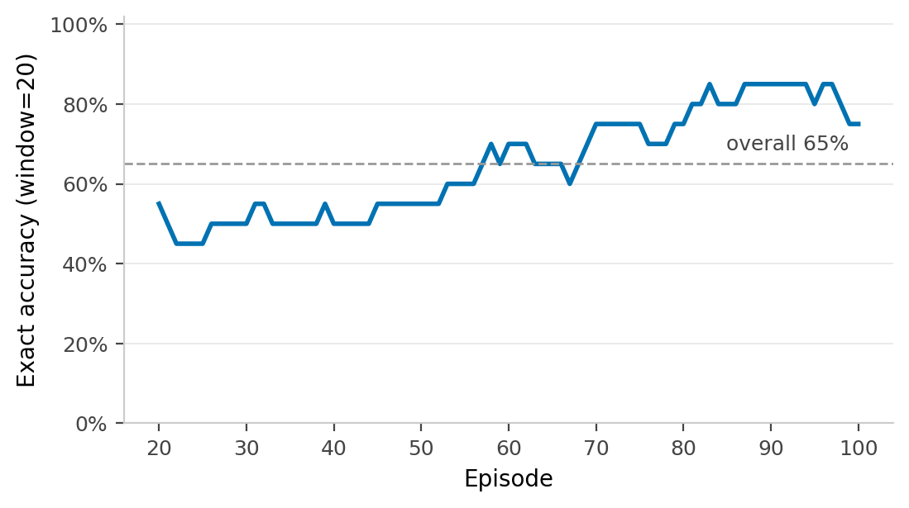
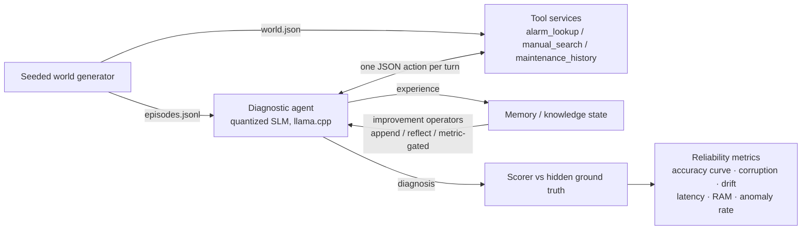

# LongHaul-Bench: Long-Horizon Reliability of Industrial Edge Agents

> **Research question:** Does an industrial diagnostic agent's knowledge state *improve* or *degrade* over 1000+ task iterations — and which improvement operators keep it reliable under edge-hardware constraints?

**Status:** Design phase (v0). Author: Vahit Feryad, PhD.

## Why this benchmark exists

Agent benchmarks today measure single-episode success on web and coding tasks, on cloud-scale models, with unlimited compute. Real industrial agents live in a different world:

- **Offline** — no cloud API; a quantized local SLM does the reasoning.
- **Long-lived** — the agent runs for months, accumulating experience across thousands of diagnostic episodes.
- **Constrained** — CPU-only or Jetson-class hardware; RAM and latency budgets are hard limits.
- **High-stakes** — a corrupted knowledge base gives confidently wrong maintenance advice.

Nobody measures whether the *self-improvement* mechanisms proposed in recent literature (experience-driven memory, reflection, metric-driven prompt optimization) stay reliable in this regime. LongHaul-Bench does.

## What is measured

Over N ≥ 1000 sequential diagnostic episodes in a synthetic industrial environment:

| Axis | Metric |
|---|---|
| Task performance | success rate curve, time-to-diagnosis |
| Knowledge integrity | corruption rate, contradiction count, stale-fact retention |
| Drift | performance on a frozen probe set re-run every K episodes |
| Edge cost | p50/p95 latency, peak RAM, tokens/episode — on CPU and Jetson |
| Safety | fallback-trigger correctness, confidently-wrong rate |

## Compared improvement operators

1. **Append-only memory** (naive baseline) — every episode's summary is stored.
2. **Reflection → structured experience** (MUSE-style) — trajectories distilled into typed records before integration.
3. **Metric-driven optimization** (DSPy/GEPA-style) — operators updated only when a held-out eval improves.
4. **Frozen agent** (control) — no learning; isolates environment drift from agent drift.

## Data sources & provenance

**No proprietary or employer data is used — by design.** A publishable, reproducible benchmark requires data anyone can regenerate and audit; confidential plant data would make the work both legally risky and scientifically unverifiable.

- **Synthetic core:** machine manuals, alarm-code tables, maintenance history, and HMI/PLC-style logs are procedurally generated from templates with a hidden ground-truth causal model, so diagnostic correctness is objectively scoreable.
- **Realism grounding (public sources only):** fault statistics and degradation patterns informed by public datasets — e.g., UCI AI4I 2020 Predictive Maintenance, NASA C-MAPSS turbofan degradation — and publicly available vendor documentation formats.
- Every run's environment is fully determined by a random seed → anyone can reproduce the exact 1000-episode world.

## Stack & reproducibility

- **Agent (M2+):** tool-using diagnostic agent — `alarm_lookup`, `manual_search`, `maintenance_history`, `log_fetch` — running a local quantized SLM (llama.cpp, 4-bit GGUF: Qwen2.5-3B, Phi-3.5-mini). Core loop kept dependency-light for edge; a LangGraph implementation is included as a comparison arm (framework overhead is itself measured).
- **Retrieval:** vector search over manual excerpts — local Qdrant (Docker) with a small embedding model; RAG quality tracked with faithfulness/context-precision metrics (DeepEval/Ragas) in the analysis appendix.
- FastAPI tool services
- Eval harness: [Inspect AI](https://inspect.aisi.org.uk/) task definitions and scorers; behavioral auditing with Petri
- **Execution in a resource-capped Linux container** (Docker, e.g. `--memory=8g --cpus=4`): enforces the constrained-device budget identically on any host and makes runs reproducible for the report
- Hardware targets: x86 CPU (8GB RAM budget) → NVIDIA Jetson Orin → Snapdragon-class devices via Qualcomm AI Hub (remote real-device profiling)

## First results — M2 smoke run (100 episodes, standard tier, CPU)

| Agent | Component acc. | Exact acc. | Latency p50 / p95 | Tokens/ep | Anomaly rate |
|---|---|---|---|---|---|
| Heuristic floor (LLM-free)¹ | — | **86.3%** | <0.01 s | 0 | 0% |
| Qwen2.5-3B Q4_K_M, frozen agent² | 73% | **65%** | 6.3 s / 7.7 s | 1502 | 0% |

¹ 1000 episodes. ² 100 episodes, tool-loop agent (mean 2.05 tool calls/ep), llama.cpp on a 14-core laptop CPU, no learning.



**Early observations.** (a) The quantized 3B agent *underperforms* the domain-heuristic floor by 21 points — which sharpens the benchmark's central question: can experience accumulation (improvement operators) close this gap without corrupting the knowledge base? (b) ~6.3 s/episode on laptop CPU confirms edge feasibility for non-interactive diagnostic workloads. (c) The apparent upward trend in the curve is episode-mix variation (the agent is frozen); quantifying such variation is exactly why the full protocol uses 5 seeds and frozen probe sets.

## Stack status (honest inventory)

| Component | Status | Where |
|---|---|---|
| Tool-calling agent loop | ✅ implemented | `agents/slm_agent.py` — JSON action protocol, mean 2.05 tool calls/ep measured |
| Quantized SLM runtime (llama.cpp) | ✅ implemented | M2 smoke run, results above |
| Agentic retrieval — keyword & vector modes | ✅ implemented | `manual_search` tool; `LONGHAUL_RETRIEVAL=vector` switches modes (ablation axis) |
| Vector DB (Qdrant, serverless local) + embedding RAG | ✅ implemented | `environments/retrieval.py` — nomic-embed-text via llama.cpp `--embeddings`, no torch/cloud; preliminary 10-ep: vector 50% vs keyword 70% (CIs overlap; full comparison in M4) |
| Inspect AI harness | ✅ implemented | `evals/longhaul_task.py` — dataset/solver/scorer, standard Inspect logs; 10-ep validation: 70% ± 15.3% |
| Improvement operators + memory budget | 🔜 M3 | planned — the core experiment |
| LangGraph comparison arm | ✅ implemented | `agents/langgraph_agent.py` — StateGraph, same protocol; 10-ep: 70% exact, p50 5.96s (no measurable overhead vs bare loop) |
| DeepEval RAG metrics (local judge) | ✅ implemented | `scripts/rag_metrics.py` — contextual relevancy with the local SLM as judge; 5-case vector mode: 0.327 |
| Jetson / Qualcomm AI Hub (GenieX, llama.cpp plugin) | 🔜 M5 | planned |

## Deployment footprint (measured, not estimated)

A key architectural split: the **on-device runtime** (what ships to the edge) vs the **lab-side harness** (evaluation tooling that never leaves the workstation).

| Component | Measured RAM | Ships to device? |
|---|---|---|
| llama-server + Qwen2.5-3B Q4 (4k ctx) | 3,650 MB | ✅ runtime |
| llama-server + nomic-embed (embeddings) | 174 MB | ✅ runtime |
| Python agent + qdrant-client (in-process) | ~90 MB | ✅ runtime |
| LangGraph + langchain imports | +38 MB | optional |
| **On-device total** | **≈ 4.0 GB** | fits an 8 GB device with ~4 GB headroom |
| Inspect AI harness | +46 MB import (lab) | ❌ lab-side |
| DeepEval, matplotlib, scipy | — | ❌ lab-side |

Device-class verdict (3B Q4 stack): **8 GB class** (Raspberry Pi 5, Jetson Orin Nano, industrial IPCs) — fits, measured. **4 GB class** — requires the 1.5B model variant (≈1.8 GB total, planned ablation). **< 2 GB** — out of scope (TinyML regime). All runtime components have native ARM64 support (llama.cpp builds, pure-Python qdrant-client/langgraph).

## Roadmap

- [ ] v0.1 — environment generator + frozen-agent baseline, 1000-episode run on CPU
- [ ] v0.2 — operators (1)–(3), comparison report
- [ ] v0.3 — Jetson + Qualcomm AI Hub measurements, quantization ablation (4-bit vs 8-bit)
- [ ] Report — arXiv technical report + blog series

## Architecture



## Quickstart

Generate a reproducible demo world — pure Python 3.10+, no dependencies:

```bash
python environments/generator.py --machines 5 --episodes 50 --seed 42 --out runs/demo
```

Outputs `world.json` (machines, alarm-code table, manual excerpts for RAG, maintenance history) and `episodes.jsonl` (diagnostic episodes with hidden ground-truth root cause). Same seed → byte-identical world. A pre-generated sample lives in `runs/demo/`.

**Difficulty tiers** (calibrated against the LLM-free heuristic baseline, 1000 episodes, seed 42):

| Tier | `--log-dropout` | `--symptom-dropout` | Baseline exact accuracy |
|---|---|---|---|
| easy | 0.0 | 0.0 | 99.9% |
| standard | 0.3 | 0.3 | 86.3% |
| hard | 0.7 | 0.5 | 73.3% |

Further hardening (multi-fault episodes, overlapping log vocabulary) is tracked in `docs/PAPER_PLAN.md` M1.

## Repository layout

```
environments/   synthetic industrial world generator
agents/         baseline agent, memory module
operators/      improvement operator implementations
evals/          Inspect AI tasks, probe sets, scorers
runs/           experiment configs + result artifacts
docs/           design notes, blog drafts
```
